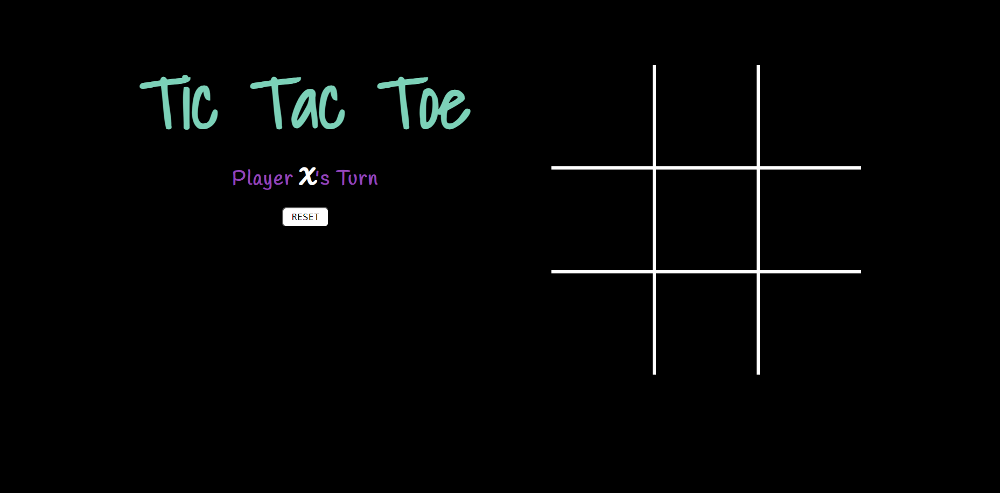

# Tic Tac Toe Game

This is a simple Tic Tac Toe game implemented using HTML, CSS, and JavaScript. It allows two players to take turns marking the spaces in a 3x3 grid with their respective symbols (usually X and O), aiming to get three of their symbols in a row, column, or diagonal.



## Features

- Classic Tic Tac Toe gameplay
- Two-player mode (X vs O)
- Responsive design for seamless usage on various devices

## Demo

You can play the Tic Tac Toe game online [here](https://rht-21.github.io/Tic-Tac-Toe).

## Installation

To play the Tic Tac Toe game locally, simply download or clone the repository and open the `index.html` file in your preferred web browser.

```bash
git clone https://github.com/yourusername/tic-tac-toe.git
cd tic-tac-toe
```

Usage (You know how to play, still...)
- Open the Tic Tac Toe game in your web browser.
- Click on an empty space in the grid to make your move.
- Take turns with the other player until one player wins or the game ends in a draw.
- Click the "Reset" button to start a new game.
